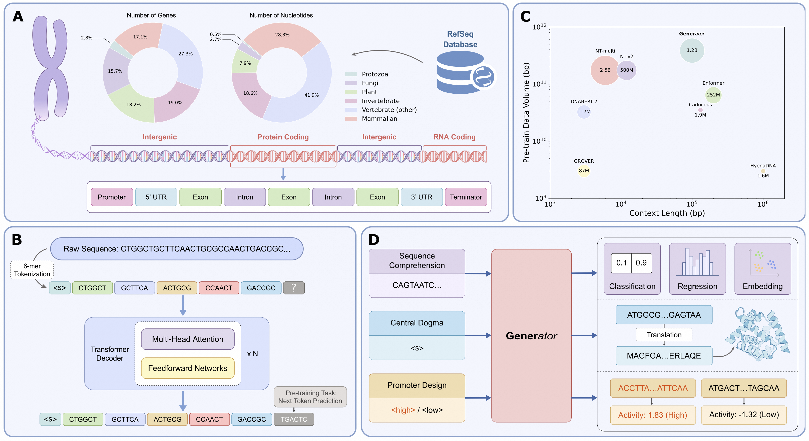

<p align="center">
  <picture>
    
  </picture>
</p>

<h1 align="center">GENERator: A Long-Context Generative Genomic Foundation Model</h1>

## ⚠️ Important Notice
If you are using **GENERator** for sequence generation, please ensure that the length of each input sequence is a multiple of **6**. This can be achieved by either:  
1. Padding the sequence on the left with `'A'` (**left padding**);  
2. Truncating the sequence from the left (**left truncation**).  

This requirement arises because **GENERator** employs a 6-mer tokenizer. If the input sequence length is not a multiple of **6**, the tokenizer will append an `'<oov>'` (out-of-vocabulary) token to the end of the token sequence. This can result in uninformative subsequent generations, such as repeated `'AAAAAA'`.  

We apologize for any inconvenience this may cause and recommend adhering to the above guidelines to ensure accurate and meaningful generation results.

## 📰 News

* 📑 **[2025-02-12]** Our paper is now available on [arXiv](https://arxiv.org/abs/2502.07272)!
* 🤗 **[2025-02-11]** Our models `GENERator-eukaryote-1.2b-base`,
  `GENERator-eukaryote-3b-base` are now available on [HuggingFace](https://huggingface.co/GenerTeam/)!

## 🔭 Overview



In this repository, we present GENERator, a collection of generative genomic foundation models utilizing the transformer
decoder architecture, trained on expansive DNA datasets derived from
the [RefSeq database](https://www.ncbi.nlm.nih.gov/refseq/). Our evaluations demonstrate that the GENERator consistently
achieves state-of-the-art performance across a wide spectrum of benchmarks,
including [Genomic Benchmarks](https://huggingface.co/datasets/katielink/genomic-benchmarks/tree/main), [NT tasks](https://huggingface.co/datasets/InstaDeepAI/nucleotide_transformer_downstream_tasks_revised),
and our newly proposed [Gener tasks](https://huggingface.co/GenerTeam).

Beyond benchmark performance, the GENERator adheres to the central dogma of molecular biology, accurately generating
protein-coding DNA sequences that produce proteins structurally analogous to known families. Moreover, the GENERator
showcases significant promise in sequence optimization, particularly in the design of enhancer sequences that regulate
gene expression during various biological stages, highlighting its potential for a series of biologically significant
tasks. Our findings position the GENERator as a vital resource for genomic research and biotechnological advancement. By
enhancing our capability to interpret and predict genomic sequences, the GENERator paves the way for profound
improvements in our understanding of complex biological systems and the development of precise genomic interventions.

For more technical details, please refer to our paper on [arXiv](https://arxiv.org/abs/2502.07272).

In this repository, you will find the following model checkpoints:

| Model Name                       | Parameters | Data  |          Category          |                                   Status                                    |
|----------------------------------|:----------:|:-----:|:--------------------------:|:---------------------------------------------------------------------------:|
| `GENERator-eukaryote-1.2b-base`  |    1.2B    | 386B  |         Eukaryote          | [Available](https://huggingface.co/GenerTeam/GENERator-eukaryote-1.2b-base) |
| `GENERator-eukaryote-3b-base`    |     3B     | 386B  |         Eukaryote          |  [Available](https://huggingface.co/GenerTeam/GENERator-eukaryote-3b-base)  |
| `GENERator-prokaryote-1.2b-base` |    1.2B    | 715B  |         Prokaryote         |                                  Coming Soon                                |
| `GENERator-prokaryote-3b-base`   |     3B     | 715B  |         Prokaryote         |                                  Coming Soon                                |

## 📈 Benchmark Performance


## 🎯 Quick Start

### Dependencies

* Clone this repo, cd into it

```shell
git clone https://github.com/GenerTeam/GENERator.git
cd GENERator
```

* Install requirements with Python 3.10

```shell
pip install -r requirements.txt
```

* To support much longer sequence lengths during pre‐training, we recommend installing both [Liger Kernel]( https://github.com/linkedin/Liger-Kernel) and [FlashAttention](https://github.com/Dao-AILab/flash-attention). Remarkably, using sliding‐window attention on just one A100 GPU, we extended the base‐pair (bp) context length to 1 million.
```shell
pip install liger-kernel
pip install flash-attn --no-build-isolation
```

> If your network cannot access huggingface.co normally, we recommend using the following command to use a mirror:
> ```shell
> export HF_ENDPOINT=https://hf-mirror.com
> ```

### Downstream

#### Variant Effect Prediction

To run the variant effect prediction task on [clinvar](https://huggingface.co/datasets/songlab/clinvar), you can use the
following command:

```shell
# Using single GPU
python src/tasks/downstream/variant_effect_prediction.py

# Using multiple GPUs (Data Parallel)
python src/tasks/downstream/variant_effect_prediction.py --dp_size ${NUM_GPUS}
```

#### Sequence Understanding (Classification/Regression)

To run the sequence understanding task
on [Gener Tasks](https://huggingface.co/datasets/GenerTeam/gener-tasks), [NT Tasks](https://huggingface.co/datasets/InstaDeepAI/nucleotide_transformer_downstream_tasks_revised), [Genomic Benchmarks](https://huggingface.co/katarinagresova), [DeepSTARR Enhancer](https://huggingface.co/datasets/GenerTeam/DeepSTARR-enhancer-activity),
you can use the following arguments:

* Gener Tasks
    * `--dataset_name GenerTeam/gener-tasks`
    * `--subset_name gene_classification` or `--subset_name taxonomic_classification`
* NT Tasks
    * `--dataset_name InstaDeepAI/nucleotide_transformer_downstream_tasks_revised`
    * `--subset_name H2AFZ` or `--subset_name H3K27ac` or ...
* Genomic Benchmarks
    * `--dataset_name katarinagresova/Genomic_Benchmarks_demo_human_or_worm` or
      `--dataset_name katarinagresova/Genomic_Benchmarks_human_ocr_ensembl` or ...
* DeepSTARR Enhancer Activity
    * `--dataset_name GenerTeam/DeepSTARR-enhancer-activity`
    * `--problem_type regression`

on following command:

```shell
# Using single GPU
python src/tasks/downstream/sequence_understanding.py \
    --model_name GenerTeam/GENERator-eukaryote-1.2b-base \
    --dataset_name ${DATASET_NAME} \
    --subset_name ${SUBSET_NAME} \
    --batch_size ${BATCH_SIZE} \
    --problem_type ${PROBLEM_TYPE} \
    --main_metrics ${MAIN_METRICS}

# Using multiple GPUs on single node (DDP)
torchrun --nnodes=1 \
    --nproc_per_node=${NUM_GPUS} \
    --rdzv_backend=c10d \
    src/tasks/downstream/sequence_understanding.py

# Using multiple GPUs on multiple nodes (DDP)
torchrun --nnodes=${NUM_NODES} \
    --nproc_per_node=${NUM_GPUS_PER_NODE} \
    --rdzv_backend=c10d \
    --rdzv_endpoint=${MASTER_ADDR}:${MASTER_PORT} \
    src/tasks/downstream/sequence_understanding.py

# Using DeepSpeed or Full Sharded Data Parallel (FSDP)
torchrun --nnodes=${NUM_NODES} \
    --nproc_per_node=${NUM_GPUS_PER_NODE} \
    --rdzv_backend=c10d \
    --rdzv_endpoint=${MASTER_ADDR}:${MASTER_PORT} \
    src/tasks/downstream/sequence_understanding.py \
    --distributed_type deepspeed # or fsdp

# Scaling more than 1 million bp context length
torchrun --nnodes=${NUM_NODES} \
    --nproc_per_node=${NUM_GPUS_PER_NODE} \
    --rdzv_backend=c10d \
    --rdzv_endpoint=${MASTER_ADDR}:${MASTER_PORT} \
    src/tasks/downstream/sequence_understanding.py \
    --distributed_type deepspeed \ # or fsdp 
    --max_len 167000 \
    --length_extension_mode=sliding_window # or yarn_rope_scaling for better performance (may need sequence parallelism)
```
> By using `--length_extension_mode=sliding_window`, you can extend the context length to arbitrary lengths.

#### Causal Language Modeling Fine-tuning

You can use the following command to fine-tune the GENERator-base model for generating specific DNA sequences, such as [DeepSTARR Enhancer](https://huggingface.co/datasets/GenerTeam/DeepSTARR-enhancer-activity), [Histone coding DNA sequence (CDS)](https://huggingface.co/datasets/GenerTeam/histone-cds), [Cytochrome P450 CDS](https://huggingface.co/datasets/GenerTeam/cytochrome-p450-cds).

```shell
# Using single GPU
python src/tasks/downstream/fine_tuning.py \
    --model_name GenerTeam/GENERator-eukaryote-1.2b-base \
    --dataset_name ${DATASET_NAME} \
    --batch_size ${BATCH_SIZE} \
    --num_train_epochs ${NUM_EPOCHS}

# Using multiple GPUs on single node (DDP)
torchrun --nnodes=1 \
    --nproc_per_node=${NUM_GPUS} \
    --rdzv_backend=c10d \
    src/tasks/downstream/fine_tuning.py

# Using multiple GPUs on multiple nodes (DDP)
torchrun --nnodes=${NUM_NODES} \
    --nproc_per_node=${NUM_GPUS_PER_NODE} \
    --rdzv_backend=c10d \
    --rdzv_endpoint=${MASTER_ADDR}:${MASTER_PORT} \
    src/tasks/downstream/fine_tuning.py

# Using DeepSpeed or Full Sharded Data Parallel (FSDP)
torchrun --nnodes=${NUM_NODES} \
    --nproc_per_node=${NUM_GPUS_PER_NODE} \
    --rdzv_backend=c10d \
    --rdzv_endpoint=${MASTER_ADDR}:${MASTER_PORT} \
    src/tasks/downstream/fine_tuning.py \
    --distributed_type deepspeed # or fsdp
```

## 📚 Datasets

* [Eukaryotic Gener Tasks](https://huggingface.co/datasets/GenerTeam/gener-tasks)
* [Prokaryotic Gener Tasks](https://huggingface.co/datasets/GenerTeam/prokaryotic-gener-tasks)
* [Next Kmer Prediction](https://huggingface.co/datasets/GenerTeam/next-kmer-prediction)

## 📜 Citation

```
@misc{wu2025generator,
      title={GENERator: A Long-Context Generative Genomic Foundation Model}, 
      author={Wei Wu and Qiuyi Li and Mingyang Li and Kun Fu and Fuli Feng and Jieping Ye and Hui Xiong and Zheng Wang},
      year={2025},
      eprint={2502.07272},
      archivePrefix={arXiv},
      primaryClass={cs.CL},
      url={https://arxiv.org/abs/2502.07272}, 
}
```
